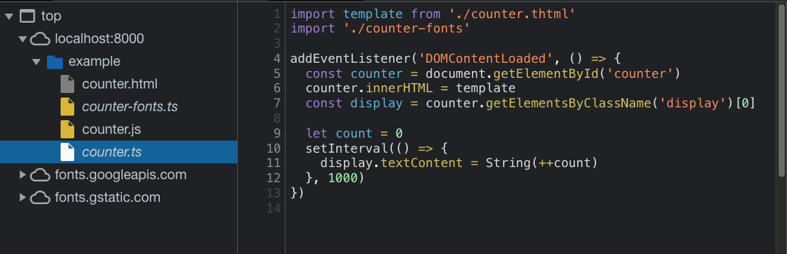
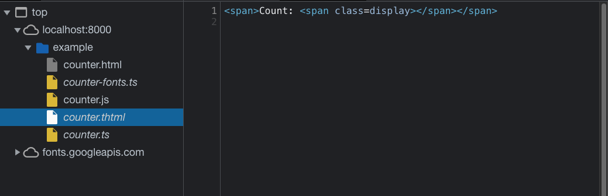

# Incomplete Source Map Produced by ESBuild

Demonstrates missing sources in the bundle source map generated by `esbuild`, if the sources were processed by a plugin. Contains small `esbuild` and `rollup` plugins and an example using them.

## Project Usage

    git clone https://github.com/prantlf/esbuild-incomplete-sourcemap.git
    cd esbuild-incomplete-sourcemap
    npm ci
    npm start &
    open http://localhost:8000/example/counter.html

## Page Example

The example is a web page powered by a small script with one dependency, which does not need a bundler, and another dependency, which does:

    counter.html                  - the web page
      └── counter.ts              - the main script module
            ├── counter-fonts.ts  - loads a web font
            └── counter.thtml     - exports a string with a HTML markup

The browser loads the built output:

    counter.html          - the web page
      ├── counter.js      - code bundle
      └── counter.js.map  - source maps

The web page displays a text and a number that increments every second:

    Count: 23

## Plugin Description

The plugins convert a text file to a JavaScript module, which exports the text file content as string.

A text file:

    Count: 

The converted JavaScript module:

    export default `Count: `
    `

* `plugin/esbuild` - the plugin for `esbuild`
* `plugin/rollup` - the plugin for `rollup`

The `esbuild` plugin is built from its source (`plugin/esbuild.src`) during the `npm` installation by running `npm run build:plugin`. The `rollup` plugin is used directly from its ESM source.

## Incomplete ESBuild

If you build the example by `npm run build:example` (the default after `npm ci`), reload the page and open the browser debugger for the example produced by `esbuild`, you will not see the module `counter.thtml`:

This is the content of `example/counter.js.map`:

    {
      "version": 3,
      "sources": ["counter-fonts.ts", "counter.ts"],
      "sourcesContent": ["...", "..."],
      "mappings": "...",
      "names": []
    }

Obviously, the module `counter.thtml` is missing there and that is why the debugger does not show it.

The code and source map for the converted output of `counter.thtml` is printed on the console during the build:

    $ npm run build:example

    example/counter.thtml:
    export default `Count: 
    `
    //# sourceMappingURL=data:application/json;charset=utf-8;base64,eyJ...X0=

    example/counter.thtml.map:
    {
      "version": 3,
      "sources": ["counter.thtml"],
      "names": [],
      "mappings": "gBAAA;CACC",
      "file": "counter.thtml.js",
      "sourcesContent": ["Count: \n"]
    }

## Complete Rollup

If you build the example by `npm run build:example:rollup`, reload the page and open the browser debugger for the example produced by `rollup`, you will see all source modules:

This is the content of `example/counter.js.map`:

    {
      "version": 3,
      "file": "counter.js",
      "sources": ["counter.thtml", "counter-fonts.ts", "counter.ts"],
      "sourcesContent": ["...", "...", "..."],
      "names": [],
      "mappings": "..."
    }

The source maps include the module `counter.thtml` and the debugger does shows it.

The code and source map for the converted output of `counter.thtml` are the same as for the `esbuild` plugin.

## Contributing

In lieu of a formal styleguide, take care to maintain the existing coding style.

## License

Copyright (c) 2021 Ferdinand Prantl

Licensed under the MIT license.

[@prantlf/dom-lite]: https://github.com/prantlf/dom-lite#readme
[Rollup]: https://rollupjs.org/
[esbuild]: https://esbuild.github.io/
[`options` parameter]: https://sass-lang.com/documentation/js-api/interfaces/Options
[`sass` compiler]: https://sass-lang.com/documentation/js-api
